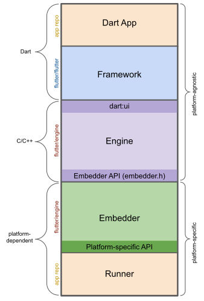

Flutter 是一个跨平台的 UI 工具集，它的设计初衷，就是允许在各种操作系统上复用同样的代码，例如 iOS 和 Android，同时让应用程序可以直接与底层平台服务进行交互。

在开发中，Flutter 应用会在一个 VM（程序虚拟机）中运行，从而可以在保留状态且无需重新编译的情况下，热重载相关的更新。

对于发行版 (release) ，Flutter 应用程序会直接编译为机器代码（Intel x64 或 ARM 指令集），或者针对 Web 平台的 JavaScript。 

Flutter 的框架代码是开源的，遵循 ==BSD== 开源协议。

## 架构

Flutter 被设计为一个可扩展的分层系统。它可以被看作是各个独立的组件的系列合集，上层组件各自依赖下层组件。组件无法越权访问更底层的内容，并且框架层中的各个部分都是可选且可替代的。

**嵌入层** 采用了适合当前平台的语言编写，例如 Android 使用的是 Java 和 C++， iOS 和 macOS 使用的是 Objective-C 和 Objective-C++，Windows 和 Linux 使用的是 C++。 Flutter 代码可以通过嵌入层，以模块方式集成到现有的应用中，也可以作为应用的主体。 

**Flutter引擎**  毫无疑问是 Flutter 的核心，它主要使用 C++ 编写，并提供了 Flutter 应用所需的原语。引擎将底层 C++ 代码包装成 Dart 代码，通过 dart:ui 暴露给 Flutter 框架层。

**Flutter框架层** 以 Dart 语言编写的现代响应式框架，它包括由一系列层组成的一组丰富的平台，布局和基础库。从下层到上层，依次有：

- 基础的 foundational 类及一些基层之上的构建块服务，如 animation、 painting 和 gestures，它们可以提供上层常用的抽象。
- 渲染层 用于提供操作布局的抽象。有了渲染层，你可以构建一棵可渲染对象的树。在你动态更新这些对象时，渲染树也会自动根据你的变更来更新布局。
- widget 层 是一种组合的抽象。每一个渲染层中的渲染对象，都在 widgets 层中有一个对应的类。此外，widgets 层让你可以自由组合你需要复用的各种类。响应式编程模型就在该层级中被引入。
- Material 和 Cupertino 库提供了全面的 widgets 层的原语组合，这套组合分别实现了 Material 和 iOS 设计规范。

Flutter 框架相对较小，因为一些开发者可能会使用到的更高层级的功能已经被拆分到不同的软件包中，使用 Dart 和 Flutter 的核心库实现，其中包括平台插件，例如 [camera](https://pub-web.flutter-io.cn/packages/camera?_gl=1*1b186je*_ga*MTE5ODkzODczNS4xNzM1OTg4MzE3*_ga_HPSFTRXK91*MTczNjM4MDMxNS42LjEuMTczNjM4MDkxNi42MC4wLjA.) 和 [webview](https://pub-web.flutter-io.cn/packages/webview_flutter?_gl=1*dsllib*_ga*MTE5ODkzODczNS4xNzM1OTg4MzE3*_ga_HPSFTRXK91*MTczNjM4Mzc2Ni43LjEuMTczNjM4Mzc2OC41OC4wLjA.)；与平台无关的功能，例如 characters、 [http](https://pub-web.flutter-io.cn/packages/http?_gl=1*dsllib*_ga*MTE5ODkzODczNS4xNzM1OTg4MzE3*_ga_HPSFTRXK91*MTczNjM4Mzc2Ni43LjEuMTczNjM4Mzc2OC41OC4wLjA.) 和 [animations](https://pub-web.flutter-io.cn/packages/animations?_gl=1*dsllib*_ga*MTE5ODkzODczNS4xNzM1OTg4MzE3*_ga_HPSFTRXK91*MTczNjM4Mzc2Ni43LjEuMTczNjM4Mzc2OC41OC4wLjA.)。还有一些软件包来自于更为宽泛的生态系统中，例如 应用内支付、 [Apple 认证](https://pub-web.flutter-io.cn/packages/sign_in_with_apple?_gl=1*wibskh*_ga*MTE5ODkzODczNS4xNzM1OTg4MzE3*_ga_HPSFTRXK91*MTczNjM4MDMxNS42LjEuMTczNjM4MDkxNi42MC4wLjA.) 和 [Lottie 动画](https://pub-web.flutter-io.cn/packages/lottie?_gl=1*1l2xz9c*_ga*MTE5ODkzODczNS4xNzM1OTg4MzE3*_ga_HPSFTRXK91*MTczNjM4MDMxNS42LjEuMTczNjM4MDkxNi42MC4wLjA.)。

## 应用剖析

通过flutter create命令创建的应用的结构如图所示

**Dart 应用**

- 将 widget 合成预期的 UI。
- 实现对应的业务
- 由应用开发者进行管理。

**框架[（源代码）](https://github.com/flutter/flutter/tree/main/packages/flutter/lib)**

- 提供了上层的 API 封装，用于构建高质量的应用（例如 widget、触摸检测、手势竞技、无障碍和文字输入）。
- 将应用的 widget 树构建至一个 Scene 中。

**引擎[（源代码）](https://github.com/flutter/engine/tree/main/shell/common)**

- 将已经合成的 Scene 进行栅格化。
- 对 Flutter 的核心 API 进行了底层封装（例如图形图像、文本布局和 Dart 的运行时）
- 将其功能通过 dart:ui API 暴露给框架。
- 使用 嵌入层 API 与平台进行整合。

**嵌入层[（源代码）](https://github.com/flutter/engine/tree/main/shell/platform)**

- 协调底层操作系统的服务，例如渲染层、无障碍和输入。
- 管理事件循环体系。
- 将特定平台的 API 暴露给应用集成嵌入层。

**运行器**

- 将嵌入层暴露的平台 API 合成为目标平台可以运行的应用包。
- 部分内容由 flutter create 生成，由应用开发者进行管理。

