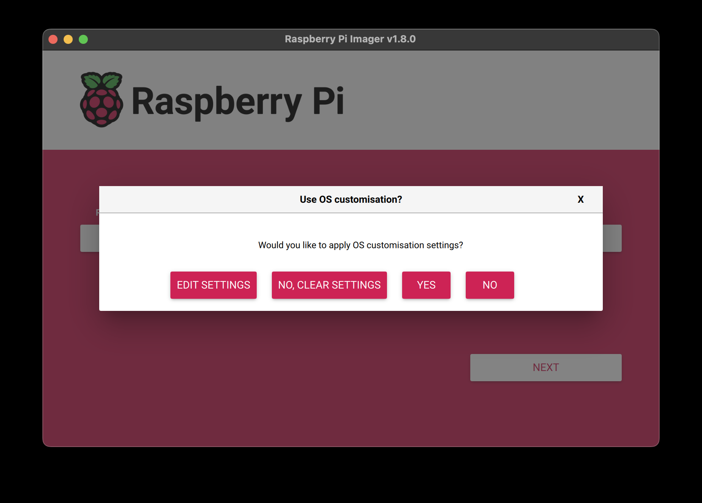

## 系统安装

### 准备一张SD卡

至少32G以上吧，留足空间。

### 下载镜像

在官方网站上[下载](https://pidoc.cn/downloads/operating-systems/#raspberry-pi-desktop)合适你的系统镜像，并准备写入SD卡（树莓派的启动盘）

### 烧录系统

在[这里](https://pidoc.cn/downloads/)下载烧录工具。工具安装在window或者macOS系统上（取决于你下载的版本），运行烧录工具，将系统镜像写入SD卡

::: note
在烧录的第一步，可以进入EDIT SETTINGS设置基本的系统信息，比如用户名、密码，Wifi连接，ssh等。

  
:::

### 启动系统

烧录完毕后，取出SD卡插入树莓派主板，上电启动。安装完毕。


## 安装node环境

ssh远程连接到树莓派设备后，执行命令

```shell
sudo apt-get install nodejs
```
国内网络，下载非常慢！！！而且安装node版本还不是最新版本！！！


## 安装docker

参数这个[链接](https://pidoc.cn/docs/pidoc/install_docker)安装docker，并配置国内加速镜像。

### 安装最新版node

参考nodejs官网[链接](https://nodejs.org/en/download)安装docker版本。

### 使用

```shell
docker run -it --rm --entrypoint sh -v /home/pi/Works:/works -p 2025:2025 node:22-alpine  
```

参数解释
- -i  保持容器的标准输入流打开，方便交互操作。
- -t  分配一个伪终端，让你可以在终端中与容器交互。

两个参数合在一起，即进入容器的交互模式。  

- --rm  容器在停止运行后会自动删除（防止产生临时的垃圾容器）。
- --entrypoint sh   将默认的 ENTRYPOINT（通常是运行 Node.js 程序）覆盖为 sh，也就是说容器启动时会直接进入 /bin/sh，而不是运行 Node 的默认程序。
- -v  /宿主目录路径:/容器内路径。挂载是双向的，容器内的更改会同步到宿主机上，宿主机上的更改会实时反映在容器内。
- -p  宿主机端口:容器端口

## 绑定静态IP

### 获取配置信息

包括现用的IP、网关、DNS信息等。

```shell
ip  a  #获取IP

ip route | grep default  #网关、以及IP
##输出：default via 192.168.2.1 dev eth0 proto dhcp src 192.168.2.103 metric 100

grep nameserver /etc/resolv.conf  #获取DNS信息
##nameserver 192.168.2.1
##nameserver fe80::5%eth0

```

### 设置静态IP

运行如下命令，进入终端设置界面

```shell
sudo nmtui
```

修改完成后，进入终端重启设置

```shell
sudo reboot
```

## 开启SMB共享

