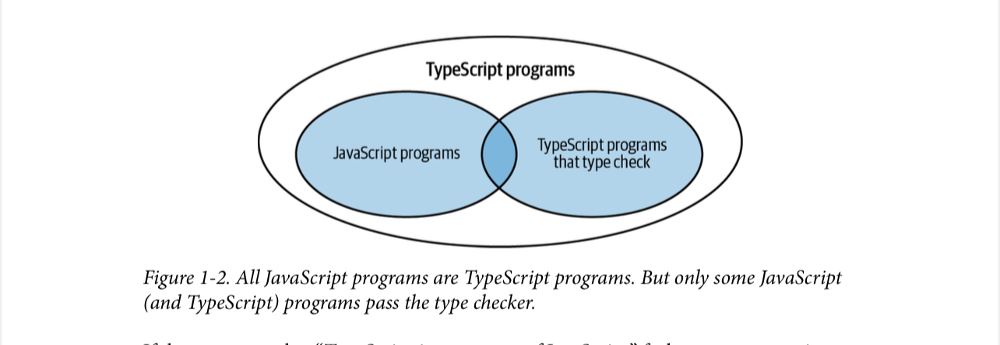

# 英文原版《Effective TypeScript》

83 Specific Ways to Improve Your TypeScript

-- Writen by Dan Vanderkam

## Getting to Know TypeScript

TypeScript is a superset of JavaScript in a syntactic sense: so long as your JavaScript program doesn’t have any syntax errors then it is also a TypeScript program.

It’s quite likely that TypeScript’s type checker will flag some issues with your code. But this is an independent problem. TypeScript will still parse your code and emit JavaScript.


All JavaScript programs are TypeScript programs, but the converse is not true: there are TypeScript programs that are not JavaScript programs. This is because TypeScript adds additional syntax for specifying types.



One of the goals of TypeScript’s type system is to detect code that will throw an exception at runtime, without having to run your code. When you hear TypeScript described as a “static” type system, it refers to this ability. The type checker cannot always spot code that will throw exceptions, but it will try.

**Things to Remember**

- TypeScript is a superset of JavaScript: all JavaScript programs are syntactically valid TypeScript programs, but not all TypeScript programs are valid JavaScript programs.
- TypeScript adds a static type system that models JavaScript’s runtime behavior and tries to spot code that will throw exceptions at runtime.
- It is possible for code to pass the type checker but still throw at runtime.
- TypeScript disallows some legal but questionable JavaScript constructs such as calling functions with the wrong number of arguments.
- Type annotations tell TypeScript your intent and help it distinguish correct and incorrect code.

## Know Which TypeScript Options You’re Using

You can create typescript configuration file by running
```shell
tsc --init
```

### noImplicitAny

noImplicitAny controls what TypeScript does when it can’t determine the type of a variable.

TypeScript is the most helpful when it has type information, so you should be sure to set noImplicitAny whenever possible. Once you grow accustomed to all variables having types, TypeScript without noImplicitAny feels almost like a different language.

### strictNullChecks

strictNullChecks controls whether null and undefined are permissible values in every type.

### Other Options

There are many other settings that affect language semantics (e.g., noImplicitThis and strictFunctionTypes), but these are minor compared to noImplicitAny and strictNullChecks. To enable all of these checks, turn on the strict setting. Type‐ Script is able to catch the most errors with strict, so this should be your goal.

If you create a project using tsc --init, you’ll be in strict mode by default.

**Things to Remember**

- The TypeScript compiler includes several settings that affect core aspects of the language.
- Configure TypeScript using tsconfig.json rather than command-line options.
- Turn on noImplicitAny unless you are transitioning a JavaScript project to TypeScript.
- Use strictNullChecks to prevent “undefined is not an object”-style runtime errors.
- Aim to enable strict to get the most thorough checking that TypeScript can offer.

## Code Generation Is Independent of Type

At a high level, tsc (the TypeScript compiler) does two thing
1. It converts next-generation TypeScript/JavaScript to an older version of JavaScript that works in browsers or other runtimes (“transpiling”)
2. It checks your code for type errors

What’s surprising is that these two behaviors are entirely independent of one another

### You Cannot Check TypeScript Types at Runtime

TypeScript types are “erasable”: part of com‐ pilation to JavaScript is simply removing all the interfaces, types, and type annota‐ tions from your code.

### Code with Type Errors Can Produce Output

You can think of all TypeScript errors as being similar to warnings in those languages: it’s likely that they indicate a problem and are worth investigating, but they won’t stop the build.

### Type Operations Cannot Affect Runtime Values

```typescript
function asNumber(val: number | string): number { 
   return val as number;
}
```

```javascript 
function asNumber(val) { 
   return val;
}
```

There is no conversion going on whatsoever. The as number is a type operation, so it cannot affect the runtime behavior of your code. To normalize the value you’ll need to check its runtime type and do the conversion using JavaScript constructs.

### Runtime Types May Not Be the Same as Declared Types

TypeScript usually flags dead code, but it does not complain about this, even with the strict option. 

 
```typescript
function setLightSwitch(value: boolean) { 
  switch (value) { 
    case true: turnLightOn(); break;
    case false: turnLightOff(); break;
    default:
      console.log(`I'm afraid I can't do that.`);
  } 
}
```

The key is to remember that boolean is the declared type. Because it is a TypeScript type, it goes away at runtime. In JavaScript code, a user might inadvertently call setLightSwitch with a value like "ON".

### You Cannot Overload a Function Based on TypeScript Types


